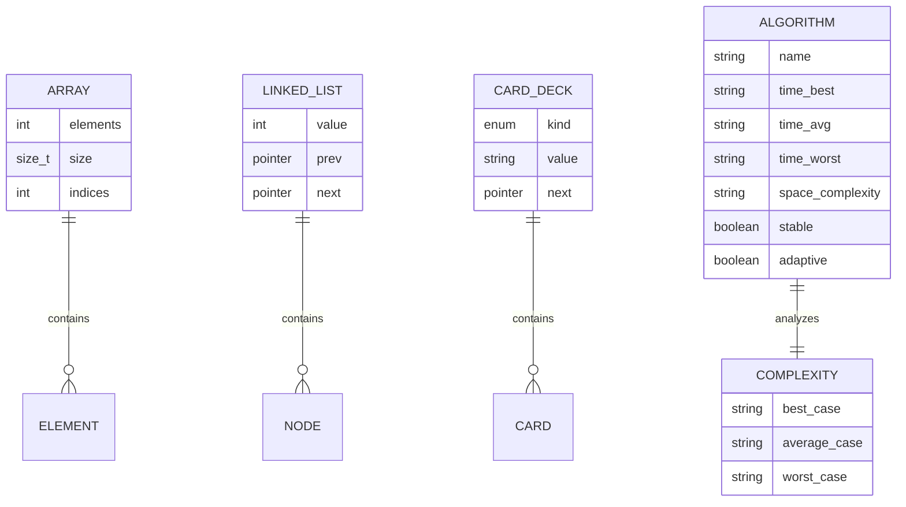
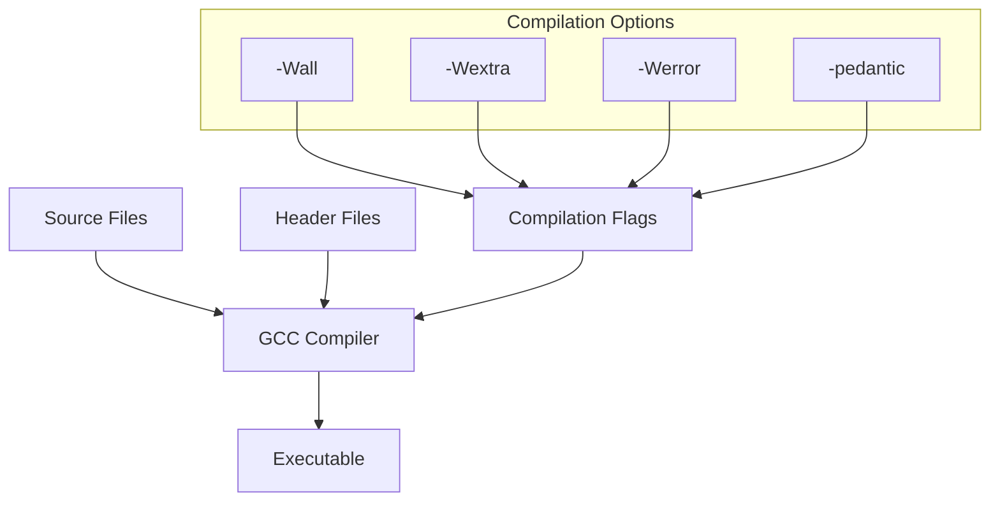
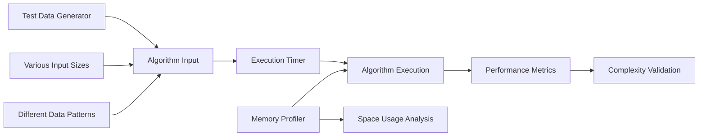

# 🏗️ System Architecture

## 📖 Overview
The Sorting Algorithms project implements a comprehensive collection of fundamental sorting algorithms in C, designed with modular architecture for easy comparison, analysis, and educational exploration. The system emphasizes clean separation between algorithm implementations, utility functions, and complexity analysis documentation.

---

## 🏛️ High-Level Architecture

```mermaid
graph TD
    A[Input Data] --> B[Algorithm Interface]
    B --> C{Algorithm Selection}
    
    C --> D[Simple Sorts O(n²)]
    C --> E[Advanced Sorts O(n log n)]
    C --> F[Specialized Sorts]
    
    D --> G[Bubble Sort]
    D --> H[Selection Sort]
    D --> I[Insertion Sort]
    
    E --> J[Quick Sort]
    E --> K[Merge Sort]
    E --> L[Heap Sort]
    
    F --> M[Counting Sort]
    F --> N[Radix Sort]
    F --> O[Shell Sort]
    
    G --> P[Visualization Layer]
    H --> P
    I --> P
    J --> P
    K --> P
    L --> P
    M --> P
    N --> P
    O --> P
    
    P --> Q[Output Display]
    
    subgraph "Analysis Framework"
        R[Big O Documentation]
        S[Performance Metrics]
        T[Complexity Analysis]
    end
    
    D --> R
    E --> R
    F --> R
    
    style D fill:#ffcccc
    style E fill:#ccffcc
    style F fill:#ccccff
```

The architecture follows a layered approach with clear separation of concerns:
- **Input Layer**: Data reception and validation
- **Algorithm Layer**: Core sorting implementations organized by complexity class
- **Visualization Layer**: Step-by-step algorithm execution display
- **Analysis Layer**: Complexity documentation and performance metrics

---

## 🧩 Core Components

### Algorithm Implementation Layer
- **Purpose**: Contains all sorting algorithm implementations with consistent interfaces
- **Technology**: C programming language with standard libraries
- **Location**: `*.c files` (0-bubble_sort.c, 3-quick_sort.c, 103-merge_sort.c, etc.)
- **Responsibilities**:
  - Implement sorting algorithms following function prototypes
  - Maintain consistent parameter and return value conventions
  - Optimize for readability and educational clarity
  - Handle edge cases (empty arrays, single elements)
- **Interfaces**: Standard function signatures defined in sort.h header file

### Header Interface Layer
- **Purpose**: Defines function prototypes, data structures, and constants
- **Technology**: C header files with structure definitions
- **Location**: `sort.h`, `deck.h`
- **Responsibilities**:
  - Declare all sorting function prototypes
  - Define data structures (listint_s for linked lists, card_s for deck)
  - Establish constants and macros for algorithm configuration
  - Ensure type safety and compilation consistency
- **Interfaces**: Included by all implementation files for type checking

### Visualization & Output Layer
- **Purpose**: Provides visual feedback for algorithm execution and debugging
- **Technology**: C standard I/O functions for formatted output
- **Location**: `print_array.c`, `print_list.c`
- **Responsibilities**:
  - Display array states during sorting process
  - Format linked list output for readability
  - Enable step-by-step algorithm visualization
  - Support debugging and educational demonstration
- **Interfaces**: Called by sorting algorithms to show intermediate states

### Complexity Analysis Documentation
- **Purpose**: Documents time and space complexity for each algorithm
- **Technology**: Plain text files with Big O notation
- **Location**: `*-O files` (0-O, 1-O, 2-O, 3-O, etc.)
- **Responsibilities**:
  - Document best-case time complexity
  - Document average-case time complexity
  - Document worst-case time complexity
  - Provide mathematical foundation for algorithm comparison
- **Interfaces**: Referenced by documentation and educational materials

---

## 📊 Data Models & Schema



### Key Data Entities
- **Array Structure**: Fixed-size integer arrays for most sorting algorithms
- **Linked List Node**: Doubly-linked list structure for list-based sorting
- **Card Structure**: Specialized structure for deck sorting with suit and value
- **Algorithm Metadata**: Complexity characteristics and properties

### Data Flow Patterns
- **Input → Process → Output**: Linear flow for simple sorting algorithms
- **Divide → Conquer → Combine**: Recursive flow for advanced algorithms
- **Count → Distribute → Reconstruct**: Specialized flow for non-comparison sorts

---

## 🔄 Algorithm Classification Architecture

```mermaid
graph LR
    A[Sorting Algorithms] --> B[Comparison-Based]
    A --> C[Non-Comparison]
    
    B --> D[Simple O(n²)]
    B --> E[Efficient O(n log n)]
    
    D --> F[Bubble Sort]
    D --> G[Selection Sort]
    D --> H[Insertion Sort]
    
    E --> I[Quick Sort]
    E --> J[Merge Sort]
    E --> K[Heap Sort]
    
    C --> L[Counting Sort]
    C --> M[Radix Sort]
    
    subgraph "Properties"
        N[Stable]
        O[In-Place]
        P[Adaptive]
    end
    
    F -.-> N
    F -.-> O
    F -.-> P
    
    style D fill:#ffeeee
    style E fill:#eeffee
    style C fill:#eeeeff
```

### Algorithm Categories

#### Simple Sorts (O(n²) Family)
- **Bubble Sort**: Adjacent comparison with early termination optimization
- **Selection Sort**: Minimum element selection with guaranteed O(n²)
- **Insertion Sort**: Incremental building of sorted portion

#### Advanced Sorts (O(n log n) Family)
- **Quick Sort**: Pivot-based divide-and-conquer with two partition strategies
- **Merge Sort**: Stable divide-and-conquer with guaranteed performance
- **Heap Sort**: Binary heap-based with optimal space complexity

#### Specialized Sorts
- **Counting Sort**: Integer distribution counting for linear time
- **Radix Sort**: Multi-digit processing for large integer sets
- **Shell Sort**: Gap-based insertion sort improvement

---

## 🎛️ Configuration & Compilation Architecture

### Build System


### Quality Assurance
- **Static Analysis**: Compiler warnings and errors enforcement
- **Style Checking**: Betty coding standard compliance
- **Memory Management**: Manual allocation with leak prevention
- **Performance Profiling**: Execution time and memory usage analysis

---

## 🔍 Performance & Optimization Architecture

### Algorithmic Optimization Strategies
1. **Early Termination**: Bubble sort optimization for already sorted arrays
2. **Pivot Selection**: Multiple partitioning strategies for Quick Sort
3. **Gap Sequences**: Knuth sequence implementation for Shell Sort
4. **Stability Preservation**: Maintaining relative order in stable sorts

### Memory Management Patterns
- **In-Place Algorithms**: O(1) space complexity optimization
- **Auxiliary Space**: Controlled memory allocation for divide-and-conquer
- **Stack Usage**: Recursive depth management and iterative alternatives

### Performance Measurement Framework


---

## 📈 Educational Architecture Design

### Learning Progression Framework
1. **Foundation Building**: Simple algorithms with clear visualization
2. **Complexity Introduction**: Gradual introduction of Big O concepts
3. **Advanced Techniques**: Sophisticated algorithms and optimizations
4. **Comparative Analysis**: Side-by-side algorithm evaluation

### Pedagogical Features
- **Step-by-Step Visualization**: Print functions for algorithm tracing
- **Incremental Complexity**: Progressive difficulty in algorithm implementation
- **Multiple Approaches**: Different solutions to the same sorting problem
- **Performance Education**: Practical complexity analysis and comparison

---

## 🔒 Quality & Reliability Architecture

### Code Quality Assurance
- **Compilation Standards**: Strict compiler flags for error detection
- **Style Compliance**: Betty coding standard enforcement
- **Function Documentation**: Comprehensive header comments
- **Modular Design**: Clear separation of concerns and responsibilities

### Testing & Validation Framework
- **Correctness Testing**: Verification with various input scenarios
- **Edge Case Handling**: Empty arrays, single elements, duplicates
- **Performance Benchmarking**: Execution time measurement
- **Memory Validation**: Leak detection and space usage verification

### Maintainability Features
- **Consistent Interfaces**: Standardized function signatures
- **Clear Naming Conventions**: Descriptive variable and function names
- **Comprehensive Documentation**: Algorithm explanations and complexity analysis
- **Modular Organization**: Logical file structure and component separation

---

## 📚 References & Dependencies
- **C Standard Library**: stdio.h, stdlib.h, stddef.h for basic functionality
- **System Headers**: For type definitions and system-specific optimizations
- **Betty Style Guide**: ALX coding standard compliance requirements
- **Algorithm Documentation**: Theoretical foundations and complexity analysis references
